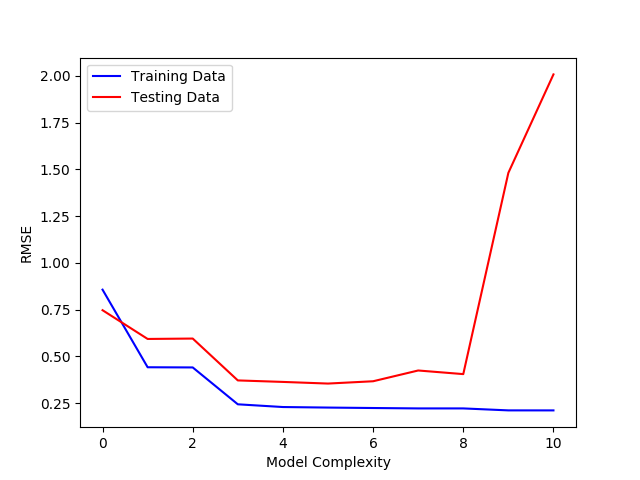

# Polynomial Regression

This project was part of the second problem set of the Intro to Machine Learning class (CS M146) I took at UCLA. I ported the code to Python3 and made slight changes to clean up the program.

## Summary

In this project, I implemented the linear and polynomial regression models and explored their effectiveness in creating a predictor that best approximates our data. Using gradient descent to solve both linear and polynomial regression, I was able to conclude that this data is better modeled with polynomial regression. In order to prevent overfitting the polynomial regression model, I used the Root-Mean-Square (RMS) error to find the best-fit polynomial regression model.

## Procedure pt.1: Linear Regression Exploration

I began by visualizing the data, using a scatterplot to observe the behavior of the X and y data points. I first plotted the training data:

and then the testing data:

From the graphs, I was able to discern that there seems to be some sort of relationship between X and y (something along the lines of "as x increases, y decreases), but there seems to be a fair amount of noise. This suggests that a linear regression model may not be very effective on this data set, and that a polynomial regression may be a better fit.

To confirm my hypothesis, I implemented a linear regression model. To solve the regression model, I decided to use the gradient descent (GD) method. With each step of GD, the updated parameters should come closer to the optimal parameters that would achieve the lowest value of the cost function J(θ).

Using different learning rates, I measured the performance of the linear regression model and compiled the results in the following table:

| Learning rates  | Coefficients             | Iterations  | Final value of J(θ)      | Execution Time (s) |
| --------------- | ------------------------ | ----------- | ------------------------ | ------------------ |
| 10-4 | [1.91573585 -1.74358989] | 10000       | 5.49356558874            | 0.473321199417     |
| 10-3 | [2.4463815 -2.81630184]  | 10000       | 3.91257640947            | 0.583308069397     |
| 10-2 | [2.44640698 -2.81635337] | 1486        | 3.91257640579            | 0.0661120414734    |
| 0.0407          | [2.44640705 -2.8163535]  | 378         | 3.91257640579            | 0.0174980163574    |

From these results, I came to an understanding that the learning rate (step size) of GD could also be parameter that you would have to tune to make sure you get the best results.

There is also an alternative way to solve linear regression, and that is the closed-form solution. This formula skips the "loop until convergence" method using in GD, and can be calculated quicker than GD. In my implementation of the closed-form solution, the coefficients and costs were almost exactly the same as the ones I got when I did GD with a learning rate of 0.0407. However, the closed-form solution algorithm ran in 0.000322103500366 seconds, which is about 54x faster than the fastest time I got for GD. While the closed-form solution seems optimal in this case, the caveat is that it may not work so well for larger data sets, and so we may want to stick with GD in cases where we have a huge amount of data.

## Procedure pt.2: Polynomial Regression Exploration

As I mentioned earlier when I was examining the data, it seemed that a polynomial regression model may be a better fit for the data. In order to confirm that, I used varying degrees of a polynomial regression model to fit and train the data, and I compiled the results into the following table (only select degrees are shown):

| Degrees  | Training data cost   | Testing data cost |
| -------- | -------------------- | ----------------- |
| 4        | 1.05508341638        | 2.64892593676     |
| 5        | 1.02886759303        | 2.5224563284      |
| 6        | 1.00758251983        | 2.70039254081     |
| 7        | 0.988185212742       | 3.6126410477      |
| 8        | 0.987995263972       | 3.29134289402     |
| 9        | 0.897005711568       | 43.8643144914     |
| 10       | 0.896246031262       | 80.6310807288     |

From these results, I found that the model with the lowest testing data cost was the model with degree 5. The polynomial regression model with the degree of 5 has the lowest cost compared to the costs of all the other models. Additionally, I can see that we begin to overfit around degree 9+, as our training data cost continues to lower but our testing data cost increases significantly.

I also used the Root-Mean-Squared error (RMSE) to measure overfitting. RMSE can tell us more about the model's quality in fitting the datset, while J(θ), our cost function, measures how strong the correlation is. In this sense, RMSE is often used over J(θ) because we want to know how well our parameters are actually fitting to the dataset.

In the following graph, I plotted model complexity against RMSE, and observed how RMSE changed with varying degrees of model complexity:

By observing the graph, I can see that we achieve the lowest RMSE at degree 5, which agrees with my results from earlier. The testing RMSE is the lowest at degree 5, while the training RMSE is also very low at degree 5. I could arguably use a model complexity of degree 5, 6, 7, or 8, but usually simpler models are more ideal.

There is also evidence of underfitting when our model complexity is low (0-1 especially) as our training and testing RMSE are both very high. As we increase our model complexity to a polynomial degree > 8, we can discern that our model is overfitting, as our training RMSE continues to decrease but our testing RMSE increases very quickly.