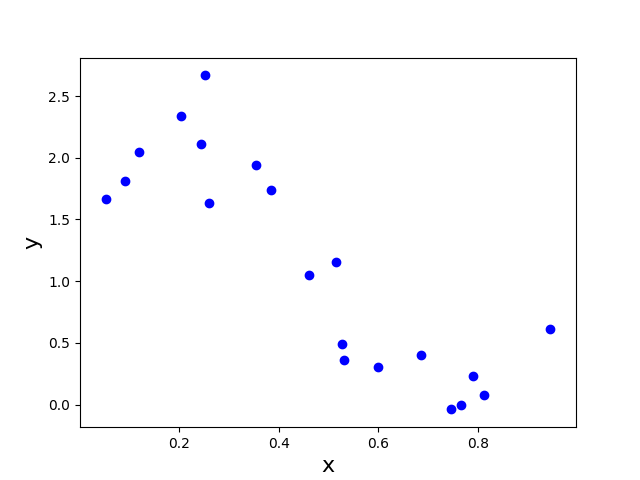
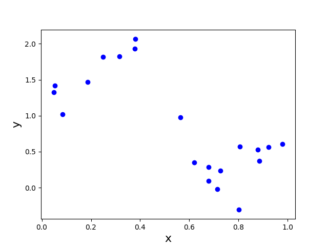

# Polynomial Regression

This project was part of the second problem set of the Intro to Machine Learning class (CS M146) I took at UCLA. I ported the code to Python3 and made slight changes to clean up the program.

## Summary

In this project, I implemented the linear and polynomial regression models and explored their effectiveness in creating a predictor that best approximates our data. Using gradient descent to solve both linear and polynomial regression, I was able to conclude that this data is better modeled with polynomial regression. In order to prevent overfitting the polynomial regression model, I used the Root-Mean-Square (RMS) error to find the best-fit polynomial regression model.

## Procedure

I began by visualizing the data, using a scatterplot to observe the behavior of the X and y data points. I first plotted the training data:

and then the testing data:

From the graphs, I was able to discern that there seems to be some sort of relationship between X and y (something along the lines of "as x increases, y decreases), but there seems to be a fair amount of noise. This suggests that a linear regression model may not be very effective on this data set, and that a polynomial regression may be a better fit.

To confirm my hypothesis, I implemented a linear regression model. To solve the regression model, I decided to use the gradient descent (GD) method. With each step of GD, the updated parameters should come closer to the optimal parameters that would achieve the lowest value of the cost function J(\theta).

Using different learning rates, I measured the performance of the linear regression model and compiled the results in the following table:

| Learning rates | Coefficients             | Iterations  | Final value of J(\theta) | Execution Time (s) |
| -------------- | ------------------------ | ----------- | ------------------------ | ------------------ |
| 10^{-4}        | [1.91573585 -1.74358989] | 10000       | 5.49356558874            | 0.473321199417     |
| 10^{-3}        | [2.4463815 -2.81630184]  | 10000       | 3.91257640947            | 0.583308069397     |
| 10^{-2}        | [2.44640698 -2.81635337] | 1486        | 3.91257640579            | 0.0661120414734    |
| 0.0407         | [2.44640705 -2.8163535]  | 378         | 3.91257640579            | 0.0174980163574    |

From these results, I understood that the learning rate (step size) of GD could also be parameter that you would have to tune to make sure you get the best results.

There is also an alternative way to solve linear regression, and that is the closed-form solution. This formula skips the "loop until convergence" method using in GD, and can be calculated quicker than GD. In my implementation of the closed-form solution, the coefficients and costs were almost exactly the same as the ones I got when I did GD with a learning rate of 0.0407. However, the closed-form solution algorithm ran in 0.000322103500366 seconds, which is about 54x faster than the fastest time I got for GD. While the closed-form solution seems optimal in this case, the caveat is that it may not work so well for larger data sets, and so we may want to stick with GD in cases where we have a huge amount of data.